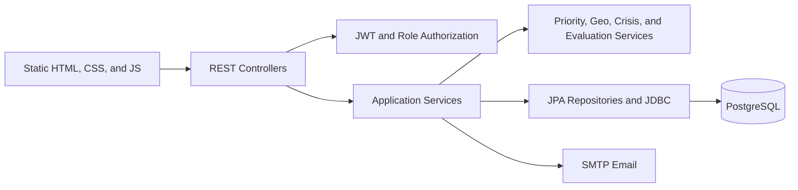

<p align="center">
  
</p>

<h1 align="center">Nidaa</h1>

<p align="center">
  A humanitarian assistance coordination platform that connects people in need with volunteers,
  organizations, psychologists, and platform administrators.
</p>

<p align="center">
  
  
  
  
  
</p>

## Overview

Nidaa provides a single place for beneficiaries to request material or psychological support and for verified responders to manage those requests. The platform combines role-based workflows with weighted priority scoring, geographic volunteer matching, crisis detection, assignment history, and strategy evaluation metrics.

The backend is a Spring Boot REST application. The frontend is a set of responsive static HTML, CSS, and JavaScript pages served directly by Spring Boot.

Repository: [github.com/Khalil-Pal/Nidaa-project](https://github.com/Khalil-Pal/Nidaa-project)

## Detailed Documentation

- [Backend guide](docs/BACKEND_GUIDE.md): startup, configuration, security, database model, APIs, request lifecycles, matching, migrations, and tests.
- [Frontend guide](docs/FRONTEND_GUIDE.md): pages, role navigation, browser state, API calls, shared layout, local-only features, debugging, and test checklists.
- [Security](docs/SECURITY.md): assets, threat model, the controls and where each is enforced, the audit findings with their fixes, and the limitations kept by choice.
- [Future work](FUTURE_WORK.md): follow-ups identified during remediation and deliberately deferred.
- [Database](docs/DATABASE.md): schema inventory (triggers, functions, views) and computed-and-stored values; data dictionary and ERD to follow.
- [Gate records](docs/gates/): PASS/FAIL evidence for every phase gate; tooling in [scripts/gate](scripts/gate/README.md).

## Core Capabilities

### Identity and access

- Email-based registration verification.
- Stateless JWT access tokens and stored refresh tokens.
- Role-based authorization with Spring Security.
- Password reset and password-change verification by email.
- Login-attempt lockout protection.
- Administrator approval for volunteer, psychologist, and organization accounts.

### Material help requests

- Submit and track food, medical, shelter, water, clothing, and other requests.
- Capture urgency, number of people, vulnerability flags, address, and coordinates.
- Calculate weighted priority from urgency, children, elderly people, disabled people, group size, and waiting time.
- Rank pending requests by priority.
- Automatically assign the nearest available volunteer or organization that lists the requested resource when coordinates exist.
- Allow volunteers and organizations to accept pending requests manually.
- Enforce request lifecycle transitions from `PENDING` to `ASSIGNED`, then `COMPLETED` or `CANCELLED`.

### Psychological support

- Submit confidential or anonymous psychological support requests.
- Detect crisis cases from the selected category and description keywords.
- Score psychological requests using urgency, crisis status, and waiting time.
- Route crisis cases to verified, on-duty psychologists.
- Balance crisis routing by active workload, rating, experience, and stable ID ordering.
- Allow psychologists to accept and update assigned cases.

### Operations and analytics

- Record material and psychological assignment history.
- Distinguish manual, geographic, crisis, and administrator assignment sources.
- Compare FIFO, weighted-scoring, and multi-objective matching strategies.
- Report urgent waiting time, urgent coverage, volunteer utilization, regional fairness, completion performance, and travel distance.
- Provide administrator dashboards for users, approvals, requests, stories, ranked queues, and evaluation results.

## User Roles

| Role | Main responsibilities |
|---|---|
| `BENEFICIARY` | Submit and track help requests, request psychological support, and manage a personal profile. |
| `VOLUNTEER` | Browse material requests, view ranked suggestions, accept work, and update request status. |
| `PSYCHOLOGIST` | Review pending support requests, accept cases, and handle crisis assignments while on duty. |
| `ORGANIZATION` | Coordinate and accept material help requests on behalf of an aid organization. |
| `ADMIN` | Approve responders, manage users and requests, inspect assignment history, and evaluate matching strategies. |

## How Matching Works

### Request priority

Priority determines which request should be reviewed first. A higher score means higher operational priority.

Material requests receive points for:

| Factor | Points |
|---|---:|
| Urgency | 10 to 40 |
| Children present | +10 |
| Elderly people present | +10 |
| Disabled people present | +15 |
| Number of people | +2 each, capped at +20 |
| Waiting time | +1 per two full hours, capped at +20 |

The total is capped at 100. Psychological requests receive urgency points, a `+35` crisis bonus, and the same waiting-time growth. Scores of pending requests are recomputed every 30 minutes so waiting time keeps counting.

### Geographic assignment

When a material request includes latitude and longitude, the production assignment flow:

1. Loads `provider_resources` rows for the request's normalized `helpType`.
2. Removes numeric rows whose `capacityAmount` is zero and malformed qualitative rows.
3. Compares positive numeric capacity with `peopleCount` for the ranked/admin capacity flag without excluding partial-capacity providers.
4. Loads available volunteers and organizations and keeps only providers whose user ID is in the eligible resource set.
5. Reads provider coordinates from `profiles` and removes providers without both values.
6. Calculates straight-line distance with the Haversine formula.
7. Orders candidates from nearest to farthest.
8. Atomically claims the first available provider, regardless of provider type.
9. Locks the matching provider-resource row and reserves up to `peopleCount` without allowing negative capacity.
10. Changes the request from `PENDING` to `ASSIGNED`.
11. Saves an `AUTO_GEO` assignment-history record with the distance and exact numeric amount reserved.

The provider claim, capacity reservation, request assignment, and history insert share one transaction. Completion keeps reserved capacity consumed; cancellation restores it exactly once. Either terminal outcome releases the provider to their saved availability preference if no other active assignment remains.

Volunteers and organizations that manually accept a request must also list a usable resource for that request's help type. Ranked-queue volunteer suggestions use the same resource filter and canonical profile coordinates.

### Crisis routing

Crisis psychological requests are routed separately. The system considers verified, on-duty psychologists and orders them by:

1. Lowest number of active assignments.
2. Highest rating.
3. Most experience.
4. Lowest stable psychologist ID as a final tie-breaker.

## Matching Strategy Evaluation

The administrator evaluation endpoint simulates three approaches over current pending requests and available volunteers:

| Strategy | Behavior |
|---|---|
| `FIFO` | Processes requests in creation order. |
| `WEIGHTED_SCORING` | Processes requests using the weighted priority score. |
| `MULTI_OBJECTIVE_OPTIMIZATION` | Combines priority, urgency, geographic distance, and regional distribution. |

The simulation does not modify assignments. It returns comparative metrics so administrators can evaluate likely operational outcomes before changing production behavior.

## Technology Stack

| Layer | Technologies |
|---|---|
| Backend | Java 17, Spring Boot 3.2, Spring MVC |
| Security | Spring Security, JJWT 0.12.3 |
| Persistence | PostgreSQL, Spring Data JPA, Hibernate, JDBC |
| Frontend | HTML5, CSS3, vanilla JavaScript, Font Awesome |
| Email | Spring Mail with configurable SMTP |
| Mapping | MapStruct, Lombok |
| Testing | JUnit 5, Mockito, Spring Boot Test |
| Build | Maven Wrapper |

## Architecture



The application follows a layered structure:

```text
Controller -> Service -> Repository -> PostgreSQL
                     -> Matching and scoring services
                     -> Email and security services
```

## Project Structure

```text
Nidaa-project/
|-- database/
|   |-- migrations/                     # Migration notes and rules (the SQL lives under src/main/resources/db/migration)
|   `-- backups/                        # Local database backups, ignored by Git
|-- postman/
|   |-- collections/Nidaa API/          # Version-controlled API requests
|   `-- globals/                        # Postman workspace variables
|-- src/
|   |-- main/
|   |   |-- java/com/humanitarian/platform/
|   |   |   |-- config/                 # Security and application configuration
|   |   |   |-- controller/             # REST endpoints
|   |   |   |-- dto/                    # Request and response contracts
|   |   |   |-- exception/              # API exception handling
|   |   |   |-- model/                  # JPA entities
|   |   |   |-- repository/             # JPA repositories
|   |   |   |-- security/               # JWT authentication
|   |   |   `-- service/                # Business and matching logic
|   |   `-- resources/
|   |       |-- static/                  # Frontend pages and assets
|   |       `-- application.properties  # Spring configuration
|   `-- test/java/                       # Unit, integration, and context tests
|-- mvnw / mvnw.cmd                      # Maven Wrapper
`-- pom.xml
```

## Prerequisites

- Java Development Kit 17.
- PostgreSQL. Version 17 is recommended for parity with the development environment.
- Git.
- An SMTP account if registration verification and password-reset email should work.
- `psql` available on `PATH`, or the full path to the PostgreSQL command-line tools.

Maven does not need to be installed globally because the repository includes the Maven Wrapper.

## Database Setup

> [!IMPORTANT]
> Hibernate schema generation is disabled with `spring.jpa.hibernate.ddl-auto=none`. Create an empty PostgreSQL database, then apply every migration beginning with the complete V1 bootstrap schema in filename order.

Create the database if it does not already exist:

```sql
CREATE DATABASE "Web_DB";
```

Migrations are applied by Flyway when the application starts (DEP-1). An empty
database receives `V1`–`V18` in order; a database built by hand before Flyway is
baselined at version 18 on first start and only later versions run on it. To
apply them without starting the application:

```bash
./mvnw flyway:migrate \
  -Dflyway.url=jdbc:postgresql://127.0.0.1:5432/Web_DB \
  -Dflyway.user=postgres -Dflyway.password="$DB_PASSWORD"
```

The files live in `src/main/resources/db/migration/`; see
[database/migrations/README.md](database/migrations/README.md) for what each
version does and the rules (never edit a shipped migration; add a new one).

## Configuration

Use environment variables for credentials and secrets. Do not commit real database, JWT, or SMTP credentials.

`src/main/resources/application.properties` is gitignored. Create it by copying the tracked template:

```bash
cp src/main/resources/application.properties.example src/main/resources/application.properties
```

Three values have **no default** and the application refuses to start without them: `DB_PASSWORD`, `JWT_SECRET` and `MAIL_PASSWORD`. Provide them as environment variables, or put them in a gitignored `.env` file at the project root, which the properties file imports automatically:

```properties
DB_PASSWORD=your-local-database-password
JWT_SECRET=output-of: openssl rand -base64 48
MAIL_PASSWORD=your-smtp-application-password
```

Browser origins allowed to call the API are set with `CORS_ORIGINS` (comma-separated, default `http://localhost:8081`).

| Variable | Purpose | Typical local value |
|---|---|---|
| `DB_URL` | PostgreSQL JDBC URL | `jdbc:postgresql://127.0.0.1:5432/Web_DB?stringtype=unspecified` |
| `DB_USERNAME` | PostgreSQL user | `postgres` |
| `DB_PASSWORD` | PostgreSQL password | Set locally |
| `JWT_SECRET` | HMAC signing secret, at least 32 bytes | Generate a private random value |
| `JWT_EXPIRATION` | Access-token lifetime in milliseconds | `900000` |
| `JWT_REFRESH_EXPIRATION` | Refresh-token lifetime in milliseconds | `604800000` |
| `MAIL_HOST` | SMTP host | Provider-specific |
| `MAIL_PORT` | SMTP port | `465` for SMTP over SSL |
| `MAIL_USERNAME` | Sender account | Set locally |
| `MAIL_PASSWORD` | SMTP or application password | Set locally |
| `CORS_ORIGINS` | Comma-separated browser origins allowed to call the API | `http://localhost:8081` |
| `NIDAA_ADMIN_EMAIL` | Address receiving approval notifications | Set locally |
| `SERVER_PORT` | HTTP port | `8081` |

PowerShell example:

```powershell
$env:DB_URL = "jdbc:postgresql://127.0.0.1:5432/Web_DB?stringtype=unspecified"
$env:DB_USERNAME = "postgres"
$env:DB_PASSWORD = "your-local-database-password"
$env:JWT_SECRET = "replace-with-a-private-random-secret-of-at-least-32-bytes"
$env:MAIL_HOST = "smtp.example.com"
$env:MAIL_PORT = "465"
$env:MAIL_USERNAME = "noreply@example.com"
$env:MAIL_PASSWORD = "your-smtp-application-password"
$env:NIDAA_ADMIN_EMAIL = "admin@example.com"
```

## Running with Docker

The quickest way to see the platform working from nothing (needs Docker with
Compose v2, nothing else):

```bash
cp .env.example .env          # set DB_PASSWORD and JWT_SECRET
docker compose up --build
```

This starts PostgreSQL 17, the application on http://localhost:8081 and a local
mail sink on http://localhost:8025 that shows the verification and reset
emails, so registration works without an SMTP account. Flyway creates the
schema on the empty database at first start; insert the first administrator as
described in [database/migrations/README.md](database/migrations/README.md).
The image never contains `.env` or `application.properties`
(`.dockerignore`); every setting reaches the container as an environment
variable from `docker-compose.yml`.

## Running Locally

Clone the repository:

```bash
git clone https://github.com/Khalil-Pal/Nidaa-project.git
cd Nidaa-project
```

Run on Windows:

```powershell
.\mvnw.cmd spring-boot:run
```

Run on Linux or macOS:

```bash
./mvnw spring-boot:run
```

Open:

- Application: [http://localhost:8081/](http://localhost:8081/)
- Health check: [http://localhost:8081/actuator/health](http://localhost:8081/actuator/health)

Build an executable JAR:

```powershell
.\mvnw.cmd clean package
java -jar target/platform-1.0.0.jar
```

## Authentication

Most API endpoints require an access token:

```http
Authorization: Bearer <access-token>
Content-Type: application/json
```

Login request:

```http
POST /api/auth/login
```

```json
{
  "email": "user@example.com",
  "password": "your-password"
}
```

Access tokens expire after 15 minutes by default. Use `/api/auth/refresh` with the refresh token to obtain a new token pair.

## Core API Endpoints

The live, generated reference is the Swagger UI at `http://localhost:8081/swagger-ui.html`
(OpenAPI document at `/v3/api-docs`). Use **Authorize** with the `data.token` value from
`POST /api/auth/login` to call protected endpoints from the browser. The table below is
a hand-written summary of the most used routes.

| Method | Endpoint | Access | Purpose |
|---|---|---|---|
| `POST` | `/api/auth/register` | Public | Start email-verified registration. |
| `POST` | `/api/auth/register/verify` | Public | Verify the code and create the account. |
| `POST` | `/api/auth/login` | Public | Obtain access and refresh tokens. |
| `POST` | `/api/auth/refresh` | Public | Rotate the refresh token and issue new tokens. |
| `POST` | `/api/auth/forgot-password` | Public | Send a password-reset code. |
| `POST` | `/api/help-requests` | Authenticated | Submit a material help request. |
| `GET` | `/api/help-requests/my` | Authenticated | View the current beneficiary's requests. |
| `PUT` | `/api/help-requests/{id}/assign` | Volunteer, organization | Accept a pending request. |
| `GET` | `/api/v1/help-requests/ranked` | Admin, volunteer, organization | View ranked requests and nearest-volunteer suggestions. |
| `GET` | `/api/provider-availability/me` | Volunteer, organization | View effective and preferred availability. |
| `PUT` | `/api/provider-availability/me` | Volunteer, organization | Set personal matching availability. |
| `GET` | `/api/users/me/profile` | Authenticated | Load the server-backed profile and matching location. |
| `PUT` | `/api/users/me/profile` | Authenticated | Save profile details and matching location. |
| `POST` | `/api/psychological-requests` | Authenticated | Submit psychological support. |
| `GET` | `/api/psychological-requests/my` | Authenticated | View the current beneficiary's support requests. |
| `GET` | `/api/psychological-requests/pending` | Psychologist, admin | View unassigned psychological requests. |
| `PUT` | `/api/psychological-requests/{id}/accept` | Psychologist | Accept a pending support request. |
| `GET` | `/api/v1/assignments/my` | Authenticated | View personal assignment history. |
| `GET` | `/api/v1/admin/dashboard/ranked` | Admin | View material and psychological priority queues. |
| `GET` | `/api/v1/admin/assignments` | Admin | View complete assignment history. |
| `GET` | `/api/v1/admin/evaluation` | Admin | Compare matching strategies and metrics. |
| `GET` | `/api/community/messages` | Volunteer, psychologist, organization, admin | View paginated shared community messages. |
| `POST` | `/api/community/messages` | Volunteer, psychologist, organization, admin | Publish a community message. |
| `DELETE` | `/api/community/messages/{id}?reason=...` | Admin | Soft-delete a message with mandatory justification. |
| `GET` | `/api/admin/community/deletions` | Admin | Review the community moderation audit. |

## Example Help Request

Coordinates are required for automatic geographic assignment:

```json
{
  "title": "Food needed for a family",
  "description": "Food assistance needed for four people",
  "helpType": "FOOD",
  "urgencyLevel": "HIGH",
  "peopleCount": 4,
  "hasChildren": true,
  "hasElderly": false,
  "hasDisabled": false,
  "address": "Amman, Jordan",
  "latitude": 31.9539,
  "longitude": 35.9106
}
```

## Postman Requests

Version-controlled Postman request definitions are available in [postman/collections/Nidaa API](postman/collections/Nidaa%20API/). They cover authentication, help requests, psychological requests, ranked queues, assignment history, administrator dashboards, and algorithm evaluation.

Set the workspace base URL to:

```text
http://localhost:8081/api
```

After login, use the returned access token as the Bearer token for protected requests.

## Testing

Run the complete test suite:

```powershell
.\mvnw.cmd test
```

Linux or macOS:

```bash
./mvnw test
```

The current tests cover:

- Application-context startup.
- Request lifecycle behavior.
- Weighted priority scoring.
- Geographic distance and combined volunteer/organization matching.
- Resource-aware automatic, ranked, and manual provider matching.
- Concurrent-safe automatic assignment behavior.
- Crisis detection and crisis routing.
- Assignment history mapping.
- Matching strategy evaluation metrics.
- Ranked administrator dashboard contracts.
- Community role enforcement and direct-message isolation.
- Mandatory moderation reasons, soft deletion, and audit snapshots.
- HTTP-layer authorization: 401 for no token, 403 for the wrong role, 404 for
  records the caller may not see, per-role status transitions.
- Persistence against a real PostgreSQL schema: every enum label the services
  emit, the `users` and `help_requests` constraints, soft deletion with dependent
  rows, and the lock-free assignment update.

### Persistence tests

The tests in `src/test/java/.../persistence` run against a database built only
from the migrations, so they also prove a fresh setup works. Create it once:

```bash
psql -U postgres -d postgres -c "CREATE DATABASE nidaa_test;"
for f in database/migrations/V*.sql; do psql -U postgres -d nidaa_test -v ON_ERROR_STOP=1 -q -f "$f"; done
```

(apply the files in version order; the shell glob sorts `V10` before `V2`, so on
a fresh database list them explicitly or use the order in
`database/migrations/README.md`). Each test runs in a rolled-back transaction, so
the database stays empty. The connection uses `DB_USERNAME` / `DB_PASSWORD` (or
the `.env` file) and `NIDAA_TEST_DB_URL` when the database is not
`localhost:5432/nidaa_test`. If the database is unreachable these tests are
skipped with a reason rather than failed.

The shared frontend module has its own Node tests: `node src/test/js/nidaa-common.test.js`.

## Current Constraints

The following boundaries are important when evaluating the current implementation:

- Automatic provider assignment filters by structured help-type resources, ranked admin responses report numeric sufficiency against `peopleCount`, and successful assignments reserve numeric capacity; free-form skills are not matched.
- The help-request form currently submits a textual address without browser-captured coordinates, so UI-created requests require a future geocoding/location step for automatic matching.
- Volunteer profile skills, schedule, and textual location are currently stored by the frontend and are not fully synchronized with the backend volunteer record.
- Haversine distance is straight-line distance, not a road route or travel-time estimate.
- Waiting-time priority points are not capped, so very old requests can produce unusually large scores.
- Strategy comparison is an analytical simulation and does not yet apply provider-resource eligibility; production material assignment uses resource-filtered nearest-volunteer matching.
- Community messages and moderation are server-backed, but likes/comments remain browser-local and community photo posts are not yet supported.

## Production Checklist

Before deploying Nidaa outside a development environment:

1. Rotate every database, SMTP, and JWT secret and provide them through environment variables or a secret manager.
2. Remove secret-bearing fallback values from tracked configuration.
3. Restrict public role registration so administrator accounts cannot be self-provisioned.
4. Restrict CORS to trusted frontend origins.
5. ~~Adopt an automated migration tool such as Flyway or Liquibase.~~ Done: Flyway (Phase 4, DEP-1).
6. Before applying V8 to an upgraded database, migrate any non-null legacy
   volunteer coordinates into `profiles`; V8 deliberately aborts if any remain.
7. Add geocoding or browser location capture with explicit user consent.
8. Configure HTTPS, secure headers, centralized logs, monitoring, and database backups.
9. Add continuous integration for tests and build verification.

## Contributing

1. Create a focused feature branch.
2. Keep changes within the relevant controller, service, repository, and frontend boundaries.
3. Add or update tests for behavioral changes.
4. Run `./mvnw test` or `.\mvnw.cmd test` before opening a pull request.
5. Include migration instructions whenever database structure changes.

```bash
git checkout -b feature/descriptive-name
git add <changed-files>
git commit -m "feat: describe the change"
git push -u origin feature/descriptive-name
```

## Project Status

Nidaa is under active development. The core request, psychological support, resource-aware combined provider assignment, transactional numeric-capacity reservation, ranking, evaluation, and reproducible database bootstrap workflows are implemented. The next major steps are automated migrations and deployment hardening.
